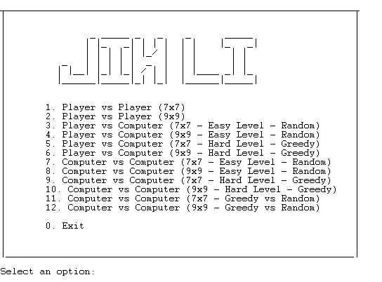

# PLOG 2020/2021 - TP1

## Group: Jin_Li_2
Turma 3

| Name             | Number    | E-Mail                |
| ---------------- | --------- | --------------------- |
| Pedro Varandas da Costa Azevedo da Ponte	   | 201809694 | up201809694@fe.up.pt  |
| Mariana Oliveira Ramos    | 201806869 | up201806869@fe.up.pt  |

---
## Installation and Execution

### Windows
 Execute `spqin.exe`, click on `File`, then `Consult` and select the file `jin_li.pl`. On the SicStus console type `jin_li.` and press enter.

### Linux
????????????????????????????

---

## The Game - JinLi

Jin Li is a strategy game for 2 players. The players each control two fish in a pond (7x7 board), either two red fish (RF) or two yellow fish (YF). Besides the fishes each player also has 10 stones stored. Players take turns during the game moving their fish.

- Each player’s Koi start in the corner squares closer to the player;
- On his turn, a player must either swim one of his fish and drop a stone or jump over a stone.
- A fish swims to an empty square adjacent (ortogonaly or diagonaly) to its current location. The stones are placed in any 
empty square. If a player has run out of stones then he does not drop after swimming.
- When jumping over a stone the jump must be along a straight line (ortogonaly or diagonaly).

After his turn the player scores one point for each other fish adjacent to his fish new location (the player can score 0, 1, 2 or 3 points on one turn). Keep track of the score using the scoring tracks placed on top and bottom of the board.
The first player to score 10 poits wins.

Some alternative rules:

- Give each player 6 stones instead of 10
- After a player drops his last stone, the other player removes one stone from the board and gives it to that player to use next turn. 

[Source](https://boardgamegeek.com/boardgame/68743/jin-li), 
[Rules](https://nestorgames.com/rulebooks/JINLI_EN.pdf)

---

## Game Logic

### Internal representation of the GameState

#### **Board**

To represent the cells of the board, we decided to use lists within a list. Each list inside the main list represents a line and each element of this list is the cell content. The content of a cell can be one out of three characters:
- RF - Red player's piece,
- YF - Yellow player's piece,
-  ' ' - empty cell.

#### **Players Kois**

To be completed while writing final report ?? Dont know what to put here

#### **Initial Situation:**

```
initialBoard([
[red,empty,empty,empty,empty,empty,red],
[empty,empty,empty,empty,empty,empty,empty],
[empty,empty,empty,empty,empty,empty,empty],
[empty,empty,empty,empty,empty,empty,empty],
[empty,empty,empty,empty,empty,empty,empty],
[empty,empty,empty,empty,empty,empty,empty],
[yellow,empty,empty,empty,empty,empty,yellow]
]).

    0   1   2   3   4   5   6    
  |---|---|---|---|---|---|---|
A |RF |   |   |   |   |   |RF |
  |---|---|---|---|---|---|---|
B |   |   |   |   |   |   |   |
  |---|---|---|---|---|---|---|
C |   |   |   |   |   |   |   |
  |---|---|---|---|---|---|---|
D |   |   |   |   |   |   |   |
  |---|---|---|---|---|---|---|
E |   |   |   |   |   |   |   |
  |---|---|---|---|---|---|---|
F |   |   |   |   |   |   |   |
  |---|---|---|---|---|---|---|
G |YF |   |   |   |   |   |YF |
  |---|---|---|---|---|---|---|

  yellow turn.
  Yellow player has 10 stones to play.
  Red player has 10 stones to play.
  Yellow Score: 0.
  Red Score: 0.


```
#### **Intermediate Situation:**

```
intermediateBoard([
[empty,empty,empty,stone,empty,empty,empty],
[empty,empty,empty,stone,stone,empty,empty],
[empty,empty,red,empty,empty,empty,stone],
[empty,stone,yellow,red,empty,stone,empty],
[stone,empty,stone,stone,empty,yellow,empty],
[empty,empty,stone,empty,stone,empty,empty],
[empty,empty,empty,stone,empty,empty,empty]
]).

    0   1   2   3   4   5   6    
  |---|---|---|---|---|---|---|
A |   |   |   | O |   |   |   |
  |---|---|---|---|---|---|---|
B |   |   |   | O | O |   |   |
  |---|---|---|---|---|---|---|
C |   |   |RF |   |   |   | O |
  |---|---|---|---|---|---|---|
D |   | O |YF |RF |   | O |   |
  |---|---|---|---|---|---|---|
E | O |   | O | O |   |YF |   |
  |---|---|---|---|---|---|---|
F |   |   | O |   | O |   |   |
  |---|---|---|---|---|---|---|
G |   |   |   | O |   |   |   |
  |---|---|---|---|---|---|---|

  yellow turn.
  Yellow player has 4 stones to play.
  Red player has 4 stones to play.
  Yellow Score: 2.
  Red Score: 3.

```

#### **Final Situation:**

```
finalBoard([
[empty,yellow,empty,stone,empty,empty,empty],
[empty,stone,yellow,stone,stone,red,red],
[empty,empty,stone,stone,stone,stone,stone],
[empty,stone,stone,empty,empty,stone,stone],
[stone,empty,stone,stone,stone,empty,empty],
[empty,empty,stone,empty,stone,empty,empty],
[empty,empty,empty,stone,empty,empty,empty]
]).

    0   1   2   3   4   5   6    
  |---|---|---|---|---|---|---|
A |   |YF |   | O |   |   |   |
  |---|---|---|---|---|---|---|
B |   | O |YF | O | O |RF |RF |
  |---|---|---|---|---|---|---|
C |   |   | O | O | O | O | O |
  |---|---|---|---|---|---|---|
D |   | O | O |   |   | O | O |
  |---|---|---|---|---|---|---|
E | O |   | O | O | O |   |   |
  |---|---|---|---|---|---|---|
F |   |   | O |   | O |   |   |
  |---|---|---|---|---|---|---|
G |   |   |   | O |   |   |   |
  |---|---|---|---|---|---|---|

  red turn.
  Yellow player has 0 stones to play.
  Red player has 0 stones to play.
  Yellow Score: 9.
  Red Score: 10.

  GAME ENDED
  Red player wins the game!

```
#### **Atoms**
	
| Code | Meaning |
| :--------------:|:---------------:|
| code(empty, '  ') | *Empty square of the board* |
| code(red, 'RF') | *Red Fish* |
| code(yellow, 'YF') | *Yellow Fish* |
| code(stone, ' O') | *Stone* |

--- 
### GameState Visualization

#### **Menu**

When iniciating the game with the predicate `jin_li/0`, it is displayed a main menu with options about the board size, the game type, the bot's difficulties and exiting the game. In order to select an option the user must press the corresponding number, dot and enter. The inputs are validated by the predicate `checkOption/2` and read by the predicate `selectAction(+Option)`.
After that, depending on the option chosen, one of the following predicates is called: 
- `play/0` wich initializes the game Player vs Player,
- `playPVsComputer(+Mode)` wich initializes the game Player vs Computer in the Mode 'random' or 'greedy',
- `playComputerVsComputer(+Mode)` wich initializes the game Computer vs Computer in the Mode 'random' or 'greedy'.
Each one of the predicates above choses randomly the first player to move their koi. And after that calls the main game loop `start_game(-GameState, -Player, -YellowStones, -RedStones, -YellowScore, -RedScore)`.





#### **Board**

In order to have a user friendly game visualization, we decided to represent the game pieces with some symbols: **RF** for red fishes, **YF** for yellow fishes, **O** for stones and **' '** for empty spaces. To do it, we use a predicate called ```code(Value, Symbol)```.
To print the board, we use the predicates: 

* ```print_board(X)``` - prints the superior limit of the table and calls the function ```print_tab```;
* ```print_tab(List)``` - calls the function ```print_line```, draws a separator between lines and calls itself;
* ```print_line(List)``` - calls ```print_cell``` and next calls itself;
* ```print_cell(List)``` - calls ```code``` function to get the symbol of the cell and prints that on the screen.


**Initial game visualization example:**

**Intermediate game visualization example:**

**Final game visualization example:**

--- 
### Valid Moves

The `valid_moves(+GameState,+Player,-ListOfMoves)` returns on ListOfPossibleMoves a list of moves in the format `[ [Fish1Row,Fish1Column,[MoveRow1,MoveColumn1], [MovRow2-MovColumn2], ...] [Fish2Row,Fish2Column,[MoveRow3,MoveColumn3], [MovRow4-MovColumn4], ...s]]`.
This predicate first calls `getPlayerPos(+GameState,+Player,-ListOfPositions)` that goes through the board and gets the position of all the player's pieces, the positions are stored in Positions.

Then it is called `getAllPossibleMoves(+GameState,+Palyer,+ListOfPositions,-ListOfMoves)` that using ` getMoves(+GameState, +InitRow, +InitColumn, -Moves),` sees if there are any possible movements in all directions (up, down, right and left). This verification consists of checking the existence of an empty cell in any surrounding position.

The predicate will fail if the ListOfPossible moves is empty.

--- 

### Making moves

The `selectPiece(GameState, Player, MidGameState, NewRow, NewColumn, Jump)` asks the player for position inputs for the selected piece and checks both row and column inputs (`checkRow`/`checkColumn`), in order to check if the player is selecting one of their pieces (using checkValueMatrix). If any of this verifications fails, the predicate asks again for input. If it succeds the predicate `selectSpot(GameState, Player, MidGameState, InitRow, InitColumn, NewRow, NewColumn, Jump)` is called asking the user for inputs and checking if it is an empty cell.

If all the verifications checks out, then it is called 'replaceValueMatrix' that replaces the old player's position for an empty space and the piece at the moving position to the player's piece, obtaining the new GameState - MidGameState.

After that it is asked the user to 

---
### Game Over
 
To check if the game is over , according to the rules already presented, we use `game_over(+Player, -NextPlayer,+Score)`. This predicate evaluates weather the current Player won or not by avaluating his current Score. If the Score is 10, means the game ended and in that case the parameter passed to the NextPlayer is 'end'.

---

### Board Avaluation

`value(+GameState, +Player, +FinalRow, +FinalCol, -Value) :-`


---

### Computer Move
 
To choose a computer move we use the predicate `choose_move(+GameState, +Player, +Level, -Move)`, where `Level` will be 'random' or 'greedy', the two difficulties we implemented in our game.
 
First `valid_moves(+GameState, +Player, -ListOfMoves)` is used to get all the possible moves, and then we will choose a move from `ListOfMoves` according to the level, explaind in the sections below.
 
#### **Level 1 - Random**
 
In level 1 the move chosen will be random using `random_member(-Elem, +List)`.
 
#### **Level 2 - Greedy**
 
In level 2 the move will be greedy, choosing the best move in the current turn. In this case both  `getMovesValuesBot/6` and ` selectBestMove/5` select a move using `findall(+Template, +Generator, -List)`. In the `Generator` the`value/4` predicate ,explaind above, is used to evaluate the board after a move. 
The `List` is `Value-SelectedPosition-MovePosition`, when there are available moves, and as `Value-SelectedPosition` otherwise. 
Finally the list is sorted, using `sort(+List1, -List2)`, being in ascending order of Values and `reverse(+List, -Last)` is used so we can get the move with the highest value.

#### **Placing Stones**


---
## Conclusion

---

## Bibliography

---
TO-DO list:

- [ ] localização inicial das carpas? (têm só nas regras alternativas) (TO THINK: should the kois always start in the corners?);

- [X] representação devia ter primeiro explicação de como o fazem;
  
- [X] não é aceitável que o tabuleiro tenha todos aqueles símbolos ligados à visualização: o tabuleiro deve ter apenas a parte do tabuleiro (carpas e pedras), complementado por informação de jogador atual, pedras e score atual de cada um;

- [ ] Será que alguma representação numérica poderia ajudar? 0 vazio, 1 pedra, 10 e 11 kois (10 + player) -> sum(surrounding cells)/10;

- [X] visualização fica muito confusa: muita densidade de coisas que não são parte do jogo só confundem... aconselhado ter tabuleiro 'isolado', complementado depois por pontuação (basta um número para isso) e pedras;

- [X] Junto da informação do turno do jogador, acrescentar o resultado atual e o número de pedras de cada um;

- [X] Faltam coordenadas!
  
- [ ] código podia estar mais flexível para dimensões de tabuleiro diferentes. - Do 8x8

- [] Regras e nossos nomes no menu