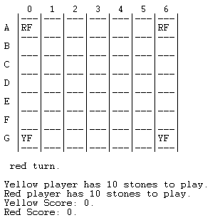

# PLOG 2020/2021 - TP1

## Group: Jin_Li_2
Turma 3

| Name             | Number    | E-Mail                |
| ---------------- | --------- | --------------------- |
| Pedro Varandas da Costa Azevedo da Ponte	   | 201809694 | up201809694@fe.up.pt  |
| Mariana Oliveira Ramos    | 201806869 | up201806869@fe.up.pt  |

---

## Jin Li

Jin Li is a strategy game for 2 players. The players each control two fish in a pond (7x7 board), either two red fish (RF) or two yellow fish (YF). Besides the fishes each player also has 10 stones stored on the right side of the board. Players take turns during the game moving their fish.

- Each player’s Koi start in the corner squares closer to the player;
- On his turn, a player must either swim one of his fish and drop a stone or jump over a stone.
- A fish swims to an empty square adjacent (ortogonaly or diagonaly) to its current location. The stones are placed in any 
empty square. If a player has run out of stones then he does not drop after swimming.
- When jumping over a stone the jump must be along a straight line (ortogonaly or diagonaly).

After his turn the player scores one point for each other fish adjacent to his fish new location (the player can score 0, 1, 2 or 3 points on one turn). Keep track of the score using the scoring tracks placed on top and bottom of the board.
The first player to score 10 poits wins.

Some alternative rules:

- Give each player 6 stones instead of 10
- After a player drops his last stone, the other player removes one stone from the board and gives it to that player to use next turn. 

[Source](https://boardgamegeek.com/boardgame/68743/jin-li), 
[Rules](https://nestorgames.com/rulebooks/JINLI_EN.pdf)

---

## Internal representation of the GameState

### Board

To represent the cells of the board, we decided to use lists within a list. Each list inside the main list represents a line and each element of this list is the cell content.

### Players Kois

To be completed while writing final report

### Initial Situation:

```
initialBoard([
[0,0,0,0,0,0,0,0,0,0,emptyS,emptyS],
[rs,emptyS,10],
[emptyS,emptyS,emptyS,emptyS,emptyS,emptyS,emptyS,emptyS,emptyS,emptyS,emptyS,emptyS],
[emptyS,emptyS,red,empty,empty,empty,empty,empty,red,emptyS,emptyS,ss],
[emptyS,emptyS,empty,empty,empty,empty,empty,empty,empty,emptyS,emptyS,t],
[emptyS,emptyS,empty,empty,empty,empty,empty,empty,empty,emptyS,emptyS,o],
[emptyS,emptyS,empty,empty,empty,empty,empty,empty,empty,emptyS,emptyS,n],
[emptyS,emptyS,empty,empty,empty,empty,empty,empty,empty,emptyS,emptyS,e],
[emptyS,emptyS,empty,empty,empty,empty,empty,empty,empty,emptyS,emptyS,ss],
[emptyS,emptyS,yellow,empty,empty,empty,empty,empty,yellow,emptyS,emptyS,emptyS],
[emptyS,emptyS,emptyS,emptyS,emptyS,emptyS,emptyS,emptyS,emptyS,emptyS,emptyS,emptyS],
[ys,emptyS,10],
[0,0,0,0,0,0,0,0,0,0,emptyS,emptyS]
]).


|---|---|---|---|---|---|---|---|---|---|---|---|
| 0 | 0 | 0 | 0 | 0 | 0 | 0 | 0 | 0 | 0 |-- |-- |
|---|---|---|---|---|---|---|---|---|---|---|---|
|                RED SCORE              |-- |10 |
|---|---|---|---|---|---|---|---|---|---|---|---|
|-- |-- |-- |-- |-- |-- |-- |-- |-- |-- |-- |-- |
|---|---|---|---|---|---|---|---|---|---|---|---|
|-- |-- |RF |   |   |   |   |   |RF |-- |-- | S |
|---|---|---|---|---|---|---|---|---|---|---|---|
|-- |-- |   |   |   |   |   |   |   |-- |-- | T |
|---|---|---|---|---|---|---|---|---|---|---|---|
|-- |-- |   |   |   |   |   |   |   |-- |-- | O |
|---|---|---|---|---|---|---|---|---|---|---|---|
|-- |-- |   |   |   |   |   |   |   |-- |-- | N |
|---|---|---|---|---|---|---|---|---|---|---|---|
|-- |-- |   |   |   |   |   |   |   |-- |-- | E |
|---|---|---|---|---|---|---|---|---|---|---|---|
|-- |-- |   |   |   |   |   |   |   |-- |-- | S |
|---|---|---|---|---|---|---|---|---|---|---|---|
|-- |-- |YF |   |   |   |   |   |YF |-- |-- |-- |
|---|---|---|---|---|---|---|---|---|---|---|---|
|-- |-- |-- |-- |-- |-- |-- |-- |-- |-- |-- |-- |
|---|---|---|---|---|---|---|---|---|---|---|---|
|              YELLOW SCORE             |-- |10 |
|---|---|---|---|---|---|---|---|---|---|---|---|
| 0 | 0 | 0 | 0 | 0 | 0 | 0 | 0 | 0 | 0 |-- |-- |
|---|---|---|---|---|---|---|---|---|---|---|---|

```

### Intermediate Situation:

```
intermediateBoard([
[1,2,3,0,0,0,0,0,0,0,emptyS,emptyS],
[rs,emptyS,4],
[emptyS,emptyS,emptyS,emptyS,emptyS,emptyS,emptyS,emptyS,emptyS,emptyS,emptyS,emptyS],
[emptyS,emptyS,empty,empty,empty,stone,empty,empty,empty,emptyS,emptyS,ss],
[emptyS,emptyS,empty,empty,empty,stone,stone,empty,empty,emptyS,emptyS,t],
[emptyS,emptyS,empty,empty,red,empty,empty,empty,stone,emptyS,emptyS,o],
[emptyS,emptyS,empty,stone,yellow,red,empty,stone,empty,emptyS,emptyS,n],
[emptyS,emptyS,stone,empty,stone,stone,empty,yellow,empty,emptyS,emptyS,e],
[emptyS,emptyS,empty,empty,stone,empty,stone,empty,empty,emptyS,emptyS,ss],
[emptyS,emptyS,empty,empty,empty,stone,empty,empty,empty,emptyS,emptyS,emptyS],
[emptyS,emptyS,emptyS,emptyS,emptyS,emptyS,emptyS,emptyS,emptyS,emptyS,emptyS,emptyS],
[ys,emptyS,4],
[1,2,0,0,0,0,0,0,0,0,emptyS,emptyS]
]).


|---|---|---|---|---|---|---|---|---|---|---|---|
| 1 | 2 | 3 | 0 | 0 | 0 | 0 | 0 | 0 | 0 |-- |-- |
|---|---|---|---|---|---|---|---|---|---|---|---|
|                RED SCORE              |-- | 4 |
|---|---|---|---|---|---|---|---|---|---|---|---|
|-- |-- |-- |-- |-- |-- |-- |-- |-- |-- |-- |-- |
|---|---|---|---|---|---|---|---|---|---|---|---|
|-- |-- |   |   |   | O |   |   |   |-- |-- | S |
|---|---|---|---|---|---|---|---|---|---|---|---|
|-- |-- |   |   |   | O | O |   |   |-- |-- | T |
|---|---|---|---|---|---|---|---|---|---|---|---|
|-- |-- |   |   |RF |   |   |   | O |-- |-- | O |
|---|---|---|---|---|---|---|---|---|---|---|---|
|-- |-- |   | O |YF |RF |   | O |   |-- |-- | N |
|---|---|---|---|---|---|---|---|---|---|---|---|
|-- |-- | O |   | O | O |   |YF |   |-- |-- | E |
|---|---|---|---|---|---|---|---|---|---|---|---|
|-- |-- |   |   | O |   | O |   |   |-- |-- | S |
|---|---|---|---|---|---|---|---|---|---|---|---|
|-- |-- |   |   |   | O |   |   |   |-- |-- |-- |
|---|---|---|---|---|---|---|---|---|---|---|---|
|-- |-- |-- |-- |-- |-- |-- |-- |-- |-- |-- |-- |
|---|---|---|---|---|---|---|---|---|---|---|---|
|              YELLOW SCORE             |-- | 4 |
|---|---|---|---|---|---|---|---|---|---|---|---|
| 1 | 2 | 0 | 0 | 0 | 0 | 0 | 0 | 0 | 0 |-- |-- |
|---|---|---|---|---|---|---|---|---|---|---|---|


```


### Final Situation:

```
finalBoard([
[1,2,3,4,5,6,7,8,9,10,emptyS,emptyS],
[rs,emptyS,0],
[emptyS,emptyS,emptyS,emptyS,emptyS,emptyS,emptyS,emptyS,emptyS,emptyS,emptyS,emptyS],
[emptyS,emptyS,empty,yellow,empty,stone,empty,empty,empty,emptyS,emptyS,ss],
[emptyS,emptyS,empty,stone,yellow,stone,stone,red,red,emptyS,emptyS,t],
[emptyS,emptyS,empty,empty,stone,stone,stone,stone,stone,emptyS,emptyS,o],
[emptyS,emptyS,empty,stone,stone,empty,empty,stone,stone,emptyS,emptyS,n],
[emptyS,emptyS,stone,empty,stone,stone,stone,empty,empty,emptyS,emptyS,e],
[emptyS,emptyS,empty,empty,stone,empty,stone,empty,empty,emptyS,emptyS,ss],
[emptyS,emptyS,empty,empty,empty,stone,empty,empty,empty,emptyS,emptyS,emptyS],
[emptyS,emptyS,emptyS,emptyS,emptyS,emptyS,emptyS,emptyS,emptyS,emptyS,emptyS,emptyS],
[ys,emptyS,0],
[1,2,3,4,5,6,7,8,9,0,emptyS,emptyS]
]).


|---|---|---|---|---|---|---|---|---|---|---|---|
| 1 | 2 | 3 | 4 | 5 | 6 | 7 | 8 | 9 |10 |-- |-- |
|---|---|---|---|---|---|---|---|---|---|---|---|
|                RED SCORE              |-- | 0 |
|---|---|---|---|---|---|---|---|---|---|---|---|
|-- |-- |-- |-- |-- |-- |-- |-- |-- |-- |-- |-- |
|---|---|---|---|---|---|---|---|---|---|---|---|
|-- |-- |   |YF |   | O |   |   |   |-- |-- | S |
|---|---|---|---|---|---|---|---|---|---|---|---|
|-- |-- |   | O |YF | O | O |RF |RF |-- |-- | T |
|---|---|---|---|---|---|---|---|---|---|---|---|
|-- |-- |   |   | O | O | O | O | O |-- |-- | O |
|---|---|---|---|---|---|---|---|---|---|---|---|
|-- |-- |   | O | O |   |   | O | O |-- |-- | N |
|---|---|---|---|---|---|---|---|---|---|---|---|
|-- |-- | O |   | O | O | O |   |   |-- |-- | E |
|---|---|---|---|---|---|---|---|---|---|---|---|
|-- |-- |   |   | O |   | O |   |   |-- |-- | S |
|---|---|---|---|---|---|---|---|---|---|---|---|
|-- |-- |   |   |   | O |   |   |   |-- |-- |-- |
|---|---|---|---|---|---|---|---|---|---|---|---|
|-- |-- |-- |-- |-- |-- |-- |-- |-- |-- |-- |-- |
|---|---|---|---|---|---|---|---|---|---|---|---|
|              YELLOW SCORE             |-- | 0 |
|---|---|---|---|---|---|---|---|---|---|---|---|
| 1 | 2 | 3 | 4 | 5 | 6 | 7 | 8 | 9 | 0 |-- |-- |
|---|---|---|---|---|---|---|---|---|---|---|---|
```

### Atoms

	
| Code | Meaning |
| :--------------:|:---------------:|
| code(empty, '  ') | *Empty square of the board* |
| code(emptyS, '--') | *Board* |
| code(red, 'RF') | *Red Fish* |
| code(yellow, 'YF') | *Yellow Fish* |
| code(stone, ' O') | *Stone* |
| code(0, ' 0') | *Number 0 - for score and nr stones* |
| code(1, ' 1') | *Number 1 - for score and nr stones* |
| code(2, ' 2') | *Number 2 - for score and nr stones*|
| code(3, ' 3') | *Number 3 - for score and nr stones* |
| code(4, ' 4') | *Number 4 - for score and nr stones* |
| code(5, ' 5') | *Number 5 - for score and nr stones* |
| code(6, ' 6') | *Number 6 - for score and nr stones* |
| code(7, ' 7') | *Number 7 - for score and nr stones* |
| code(8, ' 8') | *Number 8 - for score and nr stones* |
| code(9, ' 9') | *Number 9 - for score and nr stones* |
| code(10, '10') | *Number 10 - for score and nr stones* |
| code(ss, ' S') | *Letter S* |
| code(t, ' T') | *Letter T* |
| code(o, ' O') | *Letter O* |
| code(n, ' N') | *Letter N* |
| code(e, ' E') | *Letter E* |
| code(rs, '                RED SCORE             ') | *Score Text* |
| code(ys, '              YELLOW SCORE            ') | *Score Text* |


--- 
## GameState Visualization

In order to have a user friendly game visualization, we decided to represent the game pieces with some symbols: **RF** for red fishes, **YF** for yellow fishes, **O** for stones and **' '** for empty spaces. To do it, we use a predicate called ```code(Value, Symbol)```.
To print the board, we use the predicates: 

* ```print_board(X)``` - prints the superior limit of the table and calls the function ```print_tab```;
* ```print_tab(List)``` - calls the function ```print_line```, draws a separator between lines and calls itself;
* ```print_line(List)``` - calls ```print_cell``` and next calls itself;
* ```print_cell(List)``` - calls ```code``` function to get the symbol of the cell and prints that on the screen.

The first and the last board lines represent a scorer for each player. As the players score points, the points appear registed in places where initially are only 0's.
In the last collumn, there is a counter of the remaining stones that each player has.

**Initial game visualization example:**


**Intermediate game visualization example:**


**Final game visualization example:**


---
## Notes:

To run the game:
* Open SICStus;
* File -> Working Directory -> src;
* Consult -> jin_li.pl;
* Type jin_li. in console.

To check the different GameStates examples, you only have to uncomment the line of the board you want to see in [initial(GameState)](src/play.pl).

---
TO-DO list:

- [X] localização inicial das carpas? (têm só nas regras alternativas) (TO THINK: should the kois always start in the corners?);

- [X] representação devia ter primeiro explicação de como o fazem;
  
- [X] não é aceitável que o tabuleiro tenha todos aqueles símbolos ligados à visualização: o tabuleiro deve ter apenas a parte do tabuleiro (carpas e pedras), complementado por informação de jogador atual, pedras e score atual de cada um;

- [ ] Será que alguma representação numérica poderia ajudar? 0 vazio, 1 pedra, 10 e 11 kois (10 + player) -> sum(surrounding cells)/10;

- [X] visualização fica muito confusa: muita densidade de coisas que não são parte do jogo só confundem... aconselhado ter tabuleiro 'isolado', complementado depois por pontuação (basta um número para isso) e pedras;

- [ ] Junto da informação do turno do jogador, acrescentar o resultado atual e o número de pedras de cada um;

- [X] Faltam coordenadas!
  
- [ ] código podia estar mais flexível para dimensões de tabuleiro diferentes.